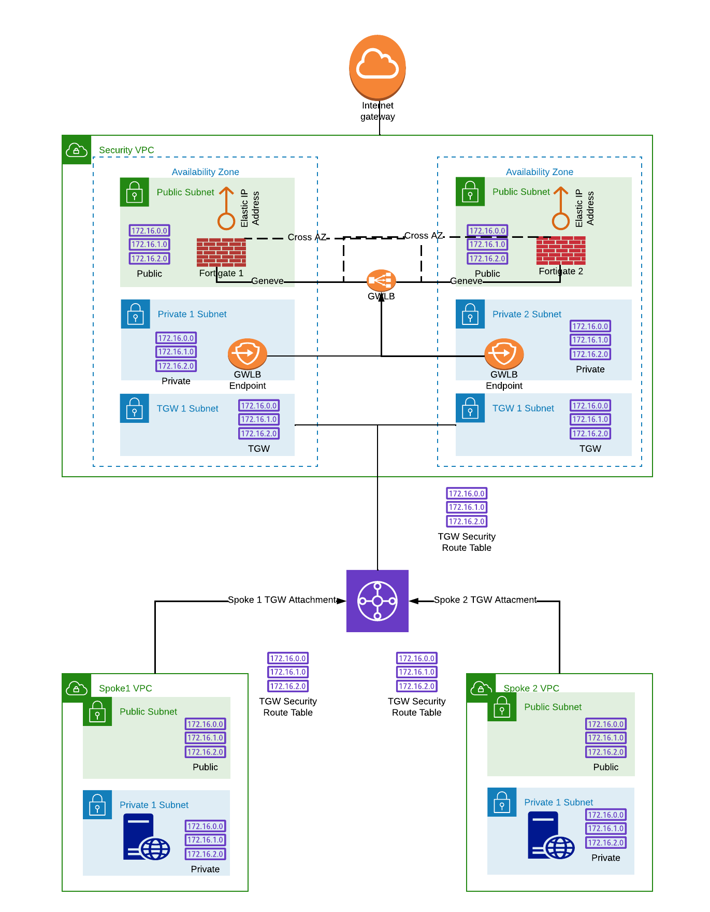

# DUAL AZ Fortigate Active-Active Pair and TGW Attachments in AWS


## Table of Contents
  - [Overview](./README.md#overview)
  - [Deployment](./README.md#deployment)
  - [Configuration](./README.md#configuration)
  - [FAQ \Troubleshoot](./README.md#faq--troubleshoot)

## Overview
This set of templates deploys a pair of Active-Active Fortigates across a DUAL AZ Base VPC setup. The Fortigates 
are configured with autoscale "configuration sync" enabled. This allows the Fortigate in AZ1 to become the 
"configuration primary" and all config changes should be performed on this instance. All changes will be synced to the 
secondary member. A warning banner is displayed if an administrator attempts to login to the secondary member and make 
configuration changes. 

Additionally, booleans are provided to enable the creation of customer VPC's with linux instances 
in each customer VPC, preconfigured with a base Apache Server. These instances can be used to generate test traffic 
that can be used to verify Fortigate inspection of North-South and East-West flows. Configurable options in the template
are as follows:
    
    use_fortigate_byol = true           # Use BYOL licensing on the Fortigate. Include licenses in /licenses directory
    create_transit_gateway = true       # create a Transit Gateway. If true, conditionally create the following:
        enable_linux_instances = true   # create linux instances in the customer VPC's behind the TGW
        appliance_mode_support = true   # enable "stickiness" on TGW Attachements
    
    enable_cross_az_lb = true           # Allow the gateway load balancer to use Cross AZ Load Balancing
    create_public_elastic_ip = true     # Create Public IPs on the Fortigate instances
    enable_fortimanager = true          # Create a Fortimanager in the Security VPC
        use_fortimanager_byol = true    # Use BYOL Licensing for Fortimanager
    
    
    

This configuration is different from an Active-Passive pair deployment. Each Fortigate will inspect traffic 
independently and session tables will not be synchronized between the Fortigates. Therefore, stateful failover is not 
possible if a single instance becomes unhealthy. 

This template configures an AWS Elastic IP on each Fortigate. This allows ingress connections to each Fortigate by 
sending the connection to the Public IP associated with that Fortigate. If other traffic should be load-balanced across
the Active-Active pair, the configuration should use a load-balancer on the North side of the pair. 

On the egress side of the firewalls, a Gateway Load Balancer load-balances all egress traffic across the Fortigate pair.

## Deployment
This set of Terraform templates should be cloned and deployed using the following commands:

    git clone https://github.com/40netse/fortigate_aa_dual_az.git
    cp terraform.tfvars.example terraform.tfvars
    edit terraform.tfvars and change user deployment options
    terraform init 
    terraform plan
    terraform apply 

To destroy the deployment:

    terraform destroy

## Configuration
A terraform.tfvars.example file is provided as a template. This should be copied to terraform.tfvars and customized for
given deployment. A few of the main customization variables include:

    aws_region = "us-west-2"            # Region to deploy the VPC
    create_transit_gateway = true/false # turn on/off the creation of the TGW and everything South
    enable_linux_instance = true/false  # if the transit gateway is enabled, turn on/off the Linux instances
    enable_fortimanager = true/false    # deploy a FortiManager
    keypair = ""                        # provide a region specific keypair for Fortigate/Linxu instances
    fortios_version = "7.2.1"           # Provide the FortiOS version matching string for correct selection of AMI
    fgt_admin_password = ""             # Initial admin password for login to the FortiOS GUI
    customer_prefix = ""                # This string will be prepended to all template resources 
    environment = ""                    # Additional id string in all template resources (prod/dev/test/etc.)
    fortigate_instance_type = ""        # aws instance type for Fortigates
    linux_instance_type = ""            # Linux test instance types
    
    default subnets will be 10.0.0.0/16 for vpc cidr

    For easy re-subnetting in the CIDR, use subnet_bits, public_subnet_index, private_subnet index, tgw_subnet_index.

    subnet cidr's defaults to 8 bits per subnet (e.g. 10.0.x.0/24 for each subnet). Adjust subnet_bits = 8 to use 
    fewer bits in the subnet mask. 

    public_subnet_index = 1 will use the first index in the range for the public subnet (e.g. 10.0.1.0/24 default)
    The index for the public subnet in the second AZ will be 10.0.10.0/24. Private will be 10.0.10.0/24, etc.

    numerous other options...

If the Fortigates or Fortimanager are using BYOL licenses, place the *.lic files in the licenses directory.

Fortigate and Linux instance userdata templates are in the config_templates directory. Modify as needed.

This set of templates conditionally creates an AWS Transit Gateway (TGW), an East VPC and West VPC with Linux 
instances in each (See Diagram). 

The purpose of this set of templates is to demonstrate east-west inspection between the east vpc and west vpc
using Transit Gateway Attachments, rather than VPN connections to the Fortigate HA Pair. Therefore, these templates 
also create the TGW, TGW Attachments for each VPC, and VPC specific route tables within the TGW to route 
the traffic correctly depending on the direction of the traffic. 

**Reference Diagram:**


These templates provide FortiOS configuration that includes a port-forwarding vip to ssh into the East VPC and 
West VPC Linux instances on port 2222 for the East VPC and 2223 on the West VPC Linux instances. You will need to 
specify the keypair to use for the Linux instances in the terraform.tfvars 
(main_scripts/fortigate_aa_dual_az/terrform.tfvars) or the ssh request will be denied.

To ssh into the Linux Instances: 

    EAST: ssh -i <path to key pair file> ubuntu@(EIP of Fortigate) -p 2222
    WEST: ssh -i <path to key pair file> ubuntu@(EIP of Fortigate) -p 2223

To access the Linux Apache Servers:
    EAST: http://<EIP of Fortigate>:8080
    WEST: http://<EIP of Fortigate>:8081

## FAQ \ Troubleshoot

debug configuration sync status on secondary member with the following CLI commands:
```
diag deb hasync -1
diag deb enable
```

This can be disabled with the following CLI commands:
```
diag deb hasync 0
diag deb disable
```

debug FortiOS configuration passed via userdata:
```
diag debug cloudinit show
```